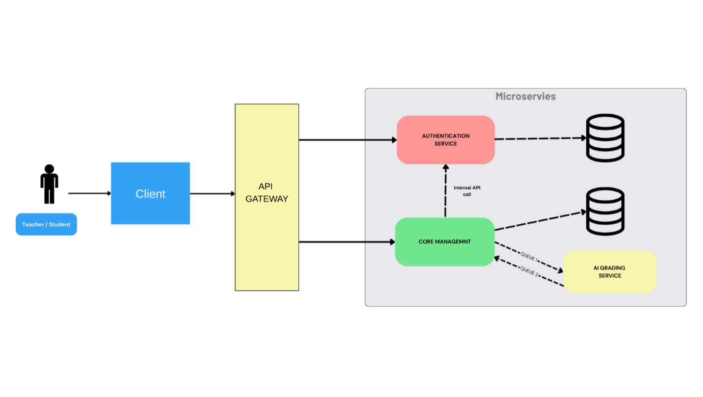
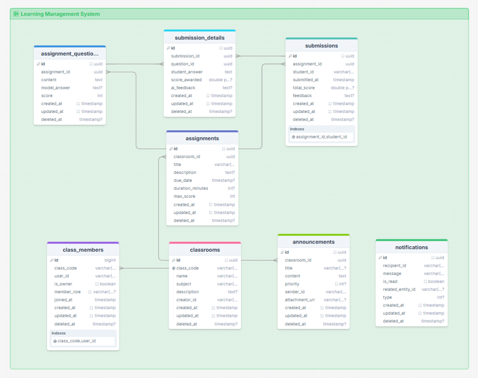
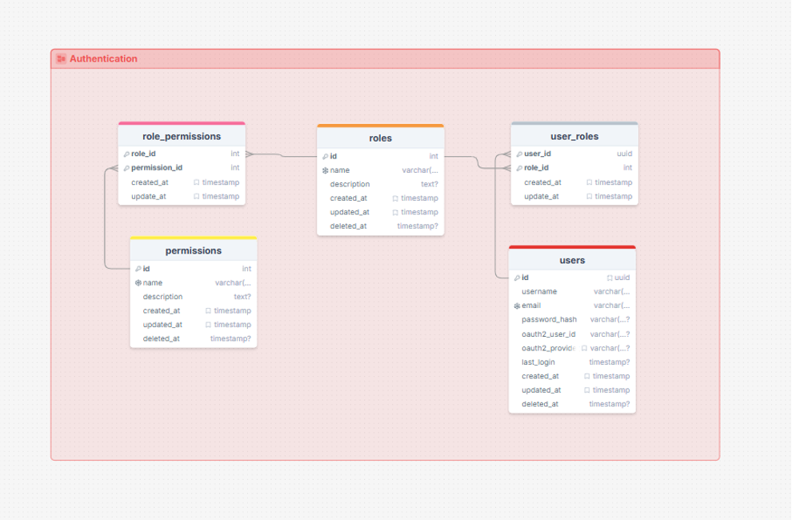
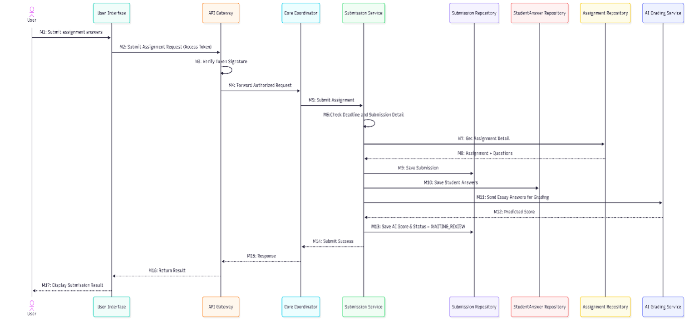
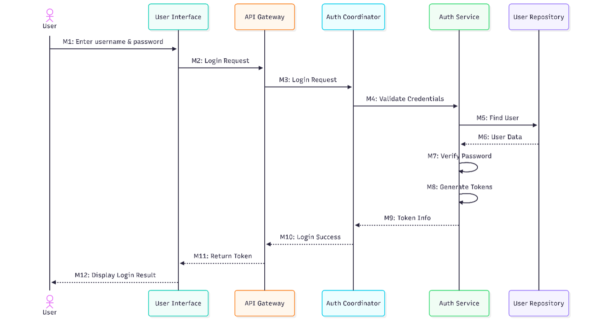

# AI-Powered Virtual Classroom Microservices

## About The Project

There is a common frustration in everyday learning: while multiple-choice tests are graded instantly, essay assignments take a massive amount of time for teachers to read and evaluate. Furthermore, when students finally get their results, they often just receive a raw score without enough detailed feedback to know exactly *why* they lost points or how to improve.

This **AI-Powered School Management System** was built to solve that exact problem. Think of it as a "Virtual Teaching Assistant." It uses AI to read student essays, suggest a score based on the teacher's criteria, and generate detailed, constructive feedback. 

### Key Features
* **Role-Based Access Control (RBAC):** Distinct workflows for Teachers and Students using stateless JWT authentication.
* **Classroom & Assignment Management:** Teachers can create classes, manage students, and assign essay-based tasks.
* **Asynchronous AI Grading:** Utilizes an AI model to evaluate student essays, providing a suggested score and detailed, actionable feedback.
* **Human-in-the-Loop:** AI acts strictly as an assistant. Generated scores are preliminary, and teachers retain the final authority to review, modify, or approve the official grades.

---

## System Architecture & Design Approach

The platform adopts a **Microservices Architecture** with asynchronous message-based integration to separate core academic workflows from computationally expensive AI processing.

### Core Components

To maintain strict service boundaries and independent deployment cycles, this project is split into two repositories:

1. **[Main Repository: Core Services](https://github.com/tienthuan19/project-virtual-classroom-microservices.git)** (This repo)
   * **Authentication Service (Spring Boot):** Manages user identity, password hashing, RBAC, and issues JWTs.
   * **Core LMS Service (Spring Boot):** Handles the core academic domain (classes, assignments, submissions).
   * **API Gateway**

2. **[AI Grading Service Repository](https://github.com/tienthuan19/ai-grading-service.git)**
   * A decoupled worker that consumes grading requests from the message queue, interacts with the Google Gemini API, and returns grading suggestions.

---

### Communication Flow
* **Synchronous (REST/HTTP):** Used for interactive, latency-sensitive operations like login, joining classes, and submitting assignments.
* **Asynchronous (RabbitMQ):** Used for the long-running AI grading process. The LMS service publishes a message to the queue, and the AI service processes it in the background, ensuring the main application remains highly responsive.

---

## Database Design

We implemented a **Database-per-Service** pattern. This ensures that each service is fully decoupled, allowing for independent schema evolution and scaling.

**LMS Domain (Core Backend ERD):**

**Authentication Domain (Identity ERD):**

---

## Core Workflows (Sequence Diagrams)

To demonstrate how the microservices interact without blocking the user interface, below is the workflow for submitting an assignment and triggering the AI grading process asynchronously:

Here is the workflow ensuring stateless authentication across services:

---

* **Core Backend:** Java, Spring Boot.
* **AI Grading Service:** Python FastAPI.
* **Message Broker:** RabbitMQ.
* **Database:** PostgreSQL (Database-per-service pattern).
* **Security:** JWT (JSON Web Tokens), OAuth2.
---

## **Most importantly:** 
The system acknowledges that AI isn't perfect. It is designed to assist teachers, not replace them. The AI does the heavy lifting, but the human teacher always has the final say in approving or modifying the official grade.

## Key Design Decisions & Trade-offs

1. **Database-per-Service:** Ensures strict data isolation. *Trade-off:* Physical foreign keys cannot be used across domains (Auth and LMS), so data consistency is handled at the application level by trusting the signed JWT.
2. **Event-Driven External API Integration:** Evaluating essays via the Google Gemini API introduces network latency and unpredictable response times. Waiting synchronously for a 3rd-party API would block the main application and ruin the UX. *Trade-off:* We decoupled this workflow using RabbitMQ. The system adopts eventual consistency, allowing the user to submit instantly while the API call is processed safely in the background.
3. **AI as a Teaching Assistant, Not a Dictator:** While the Gemini API is highly capable, blindly trusting any Generative AI for official student evaluation is risky due to edge cases or misinterpretations. By designing the system so the AI only provides *grading suggestions*, we keep the human teacher firmly in control. This aligns with real-world school policies where AI empowers educators rather than replacing them.
